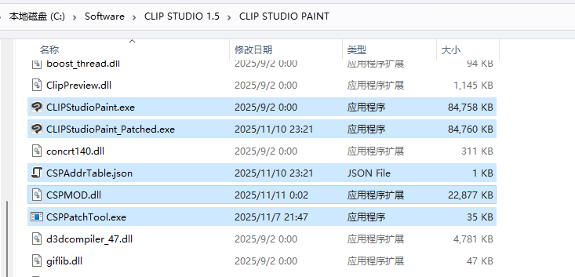
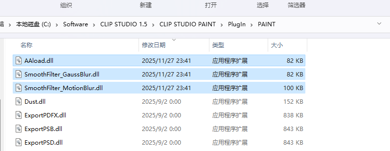
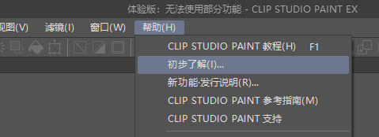
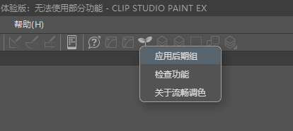
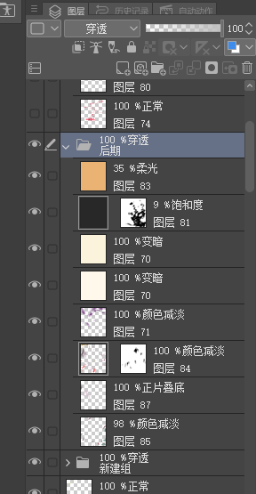

# CSP流畅调色 ClipStudioPaint-Smooth-Color-Adjustment

使用前请务必详细阅读此Readme文件！

Please read this Readme file carefully before use!

我通过对CSP程序的直接修改，以及CSP插件的开发，解决了当前CSP在调色、模糊功能上的预览不实时的问题。同时也让缩时摄影的导出能自定义视频大小与时长。

## 下载

这个页面的Code->Download下载的内容是源码，你一般不会需要源码的所以不要点这里。
只使用工具的话请点击这个链接进行下载
https://github.com/MMmmmoko/ClipStudioPaint-Smooth-Color-Adjustment/releases

## 版本适用情况

### CSP

此工具设计为**可以用于未来版本的CSP**，但是在使用未来版本的CSP时需要对功能是否可用进行一次验证。因为工具在生成关于新版本的信息时，即使没有报错也不代表CSP没有修改底层逻辑，这些无法预料的底层修改是可能造成本工具提供的功能产生错误的。测试的版本：4.0.3、4.1.4、4.2.0

**对于某些来源的学习版不可用**

### 优动漫

现在已经支持绝大部分功能，优动漫的缩时摄影无法正确导出较大图像尺寸的视频（能超过1280px一些，但是超过太多了不行，原因不明。），测试的版本：3.0.6PRO体验版、EX版。

优动漫发生莫名其妙的无法启动的问题的时候，打开任务管理器结束里面的优动漫进程就好了。

### MacOS

新版不可用（因为我现在准备开始用win画画了

## 正版支持声明

本工具不提供除“插件”之外的功能破解，请购买支持正版。

## 使用方法

将下载到的文件CSPMOD.dll和CSPPatchTool.exe移动到CLIPStudioPaint.exe所在的文件夹内（注意是有Paint后缀的，不是CLIPStudio.exe，优动漫是UDMPaintPRO.exe/UDMPaintEX.exe）。双击运行CSPPatchTool.exe，如果成功，此时文件夹内会生成一个json文件，如下图。

有可能出现因为没有文件夹内的写入权限而创建文件失败，这种情况对CSPPatchTool.exe右键用管理员身份启动即可。

将工具附带的除CSPMOD.dll之外的dll放进当前文件夹内部的
`PlugIn\PAINT\`
文件夹中即可完成此工具的安装。

### 色调调整&色调调整图层&模糊滤镜

进入软件后，调色功能按以往的方式直接使用即可。本辅助工具支持色相明度饱和度、色彩平衡、曲线的预览。

本工具提供的模糊滤镜入口在滤镜菜单的“流畅调色”内，支持高斯模糊和移动模糊。

### 缩时摄影

缩时摄影会在导出时会再弹出一个对话框让你填写视频大小和时长，这里你可以不再受选项的限制，自己按需导出，导出大于1280像素大小的视频也是可以的，因为本来就录制得很大，只是CSP不让你导出大的。
**有些版本缩时摄影选择非“原长”的视频时长时，才可以自定义视频时长**。
**优动漫无法正确导出较大图像的视频**。

### 工具菜单

此工具将“帮助”->“初步了解”（优动漫为“帮助”->“遇到问题”）改为了菜单入口。可以在这里点击或者将其加入命令栏后点击命令栏图标，会出现本工具的菜单入口。

  
  

对于未来可能遇到的使用某个功能导致CSP崩溃的情况，可以在上方入口的“**检查功能**”里对特定功能进行禁用。

### 应用后期组

应用后期组是此工具提供的一个可以进行多图层同时调色的功能，主要用于绘画中后期在保持图层的情况下进行整体调整。
使用方法为先创建一个名为“后期”的模式为“穿透”的未锁定的图层组（这个图层组不能在其他图层组内），按自己的需要向里面添加带混合模式的图层或者色调调整图层以进行调色。

  

调整满意后从工具菜单入口点击应用后期组，执行完后，这个“后期”组的内容便被应用到了其下方的所有未锁定图层中。然后就可以继续在原图层上作画了。

***注意！应用后期组是一个不可撤回、不稳定的功能，不论是为了防止结果与期望不同还是防止中途软件崩溃，你都应该在执行前对作品进行保存！**
***注意！“后期”图层组下方不应该有其他调色功能的图层（带混合模式的图层或者色调调整图层），这会使执行结果与预期出现明显不同**

## 问题反馈

我不会经常浏览Github，如果有问题需要我尽快答复的话请不要在这里问，我可能看不到的..可以来b站私信问我https://space.bilibili.com/5808772

## 免责声明

CSP流畅调色是一个免费提供的，用于改善CSP功能的辅助工具。
此工具会不可避免地增加CSP的不稳定性，程序崩溃主要发生在使用未测试的CSP版本的某些此工具覆盖的功能时。
本工具不提供任何保证，使用者必须自行在自己实际项目中使用前对此工具功能的稳定性进行验证。
任何因为使用此工具而造成的后果（包括程序崩溃造成的进度丢失或其他潜在的法律风险）均由使用者承担。

## 吐槽

我没有做性能上的优化。**CSP的预览问题根源在于官方开发者丝毫没有任何使用硬件加速和多线程的行动，它是一个巨无霸单线程纯CPU程序。** 在没有源码的情况下很难进行GPU迁移。（它甚至连缩时回放的预览都在用CPU软解）要不是功能够多、CPU足以应付中小号笔刷绘制，这个软件是必然会被新晋的专业绘画软件淘汰的（我逆向的时候都在想我干嘛不直接自己写个绘画软件）。

想感受CSP狗屎代码可以阅读或者编译此库中的HSV滤镜插件，代码是官方提供的SDK里的，它的逻辑逻辑和CSP内部自带的HSV调色代码逻辑是相同的。

如果CSP官方哪天突然一激灵改善了基础体验问题，请不要忘记我来过。

在处理优动漫的启动问题的时候找到了一个不需要修改任何文件的自动注入方案，所以虽然现在程序名为CSPPatchTool（CSP补丁工具）但它没有对原程序进行打补丁...

## 编译

下面的内容不是写给普通使用者的，只使用工具的话不用看下面啦。

我已将依赖都放置入库中Common/bin，部分文件超大，我将其打包了一下，需要将其中的压缩包就地解压，解压后的路径应该是Common/bin/*.lib，然后库中的VS解决方案基本就可以直接进行编译了，不过工程属性中仍然有部分难以修改的绝对路径。如果你想要编译和修改此工具，还需要对项目属性的【调试】中的路径和【生成事件->生成后事件】中的路径进行删除或手动指定。DEBUG模式下，需要将Dll文件使用的UI资源（DuiResource文件夹）放置在CLIPStudioPaint_Patched.exe所在的文件夹内，RELEASE模式使用的是Dll内嵌资源，请参考Dui/CatDuiThread.cpp
